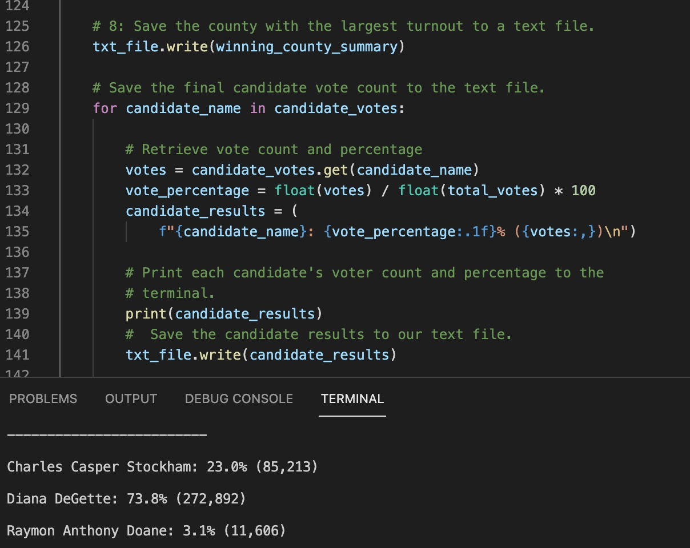

# Election_analysis
## Purpose of this election audit analysis
Tom prepard the election report for total number of vote for each candiate, the percentage of votes for each candidate, and the winner of the election. Tom usually use the excel to get the number, but this year, his boss want to use Python to get the result.
## Election-Audit Results.
### Total votes were cast in this congressional election

### The breakdown of the number of votes and the percentage of total votes for each county in the precinct

### The largest county number of votes

### The breakdown of the number of votes and the percentage of the total votes each candidate received

### The candidate won the election

## Election-Audit Summary:

Using Python to create this script, it can easy to give use the total vote, the winner of this elections and which county has the largest number of vote. Also, we can see the percentage of votes won by each county and percentages of each candidate. This script can be used in many elections, if we do some change. In this case, we use the county, we can change it to provinces or countries.  
 
